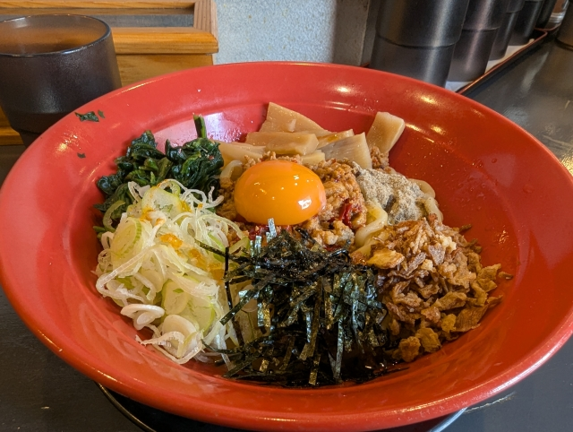

<!-- ↓元のHTMLのsection内をそのまま貼ってOK -->
<!-- 
page.url: {{ page.url }}
 -->
  <section id="1" data-aos="fade-up">
        <h2>おいしいよ</h2>

  

    
<!-- マウスホバーで画像を拡大 -->
  
  

  
最近のちょこっと趣味

  

  

    
<!-- マウスホバーで画像を拡大 -->
  
  

  
台湾まぜそば

  

  

    
<!-- マウスホバーで画像を拡大 -->
  
  

  
台湾まぜそば

  

    
 
    

      

        
<!-- マウスホバーで画像を拡大 -->
      
      

      
キャプション

      

      

        
<!-- マウスホバーで画像を拡大 -->
      
      

      
キャプション

      

      

        
<!-- マウスホバーで画像を拡大 -->
      
      

      
キャプション

      

        

        
            
  
</section>
<section id="2">
  

    <h2>お知らせ</h2>

    <!-- 
    <h3><a href="{{ post.url }}">{{ post.title }}</a></h3>
    
{{ post.excerpt }}

     -->

    <ul class="news-list">
      <li class="item">
          <a href="#">
              
2023/07/01

              
ここにお知らせが入りますここにお知らせが入りますここにお知らせが入ります

          </a>
      </li>
      <li class="item">
          <a href="#">
              
2023/07/01

              
ここにお知らせが入りますここにお知らせが入りますここにお知らせが入ります

          </a>
      </li>
      <li class="item">
          <a href="#">
              
2023/07/01

              
ここにお知らせが入りますここにお知らせが入りますここにお知らせが入ります

          </a>
      </li>
  </ul>

</section>
